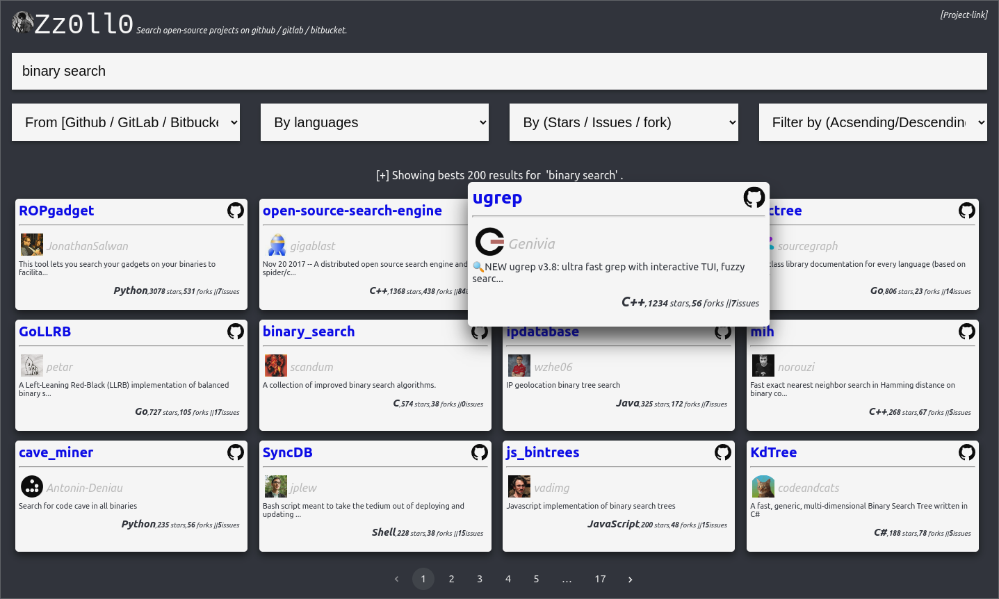

# Zolo

A simple ReacJs-SearchEngine for Open-sources projects on Github, GitLab and Bitbucket !



[DEMO-VIDEO](https://www.loom.com/share/6ffd428b077f4ffeb7c35f2f1d56d74b)

[SEARCH-ENGINE-LINK](https://bit.ly/thezolo/)

## Requirements

- Yarn/Npm
- create-react-app

## How to install

You just have to run :
```shell
# Using yarn or npm
yarn install
# or
npm install
```
## How to launch

You just have to run :
```shell
# Using yarn or npm

yarn start
# or
npm start
# The application will be running on 
# http://localhost:3007 
```

## Author

- Sanix-darker

## Contributors

- DTan13
